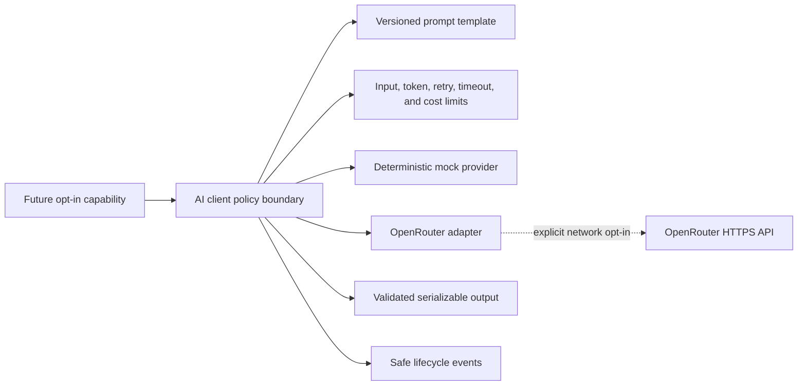

# AI foundation

## Purpose and boundary

The AI foundation is a controlled, provider-neutral communication layer for future quality-engineering capabilities. It validates configuration and prompts, enforces network and usage policy, resolves one named secret only at execution time, invokes a registered provider, validates structured output, and returns plain serializable results.

The communication layer now supports an advisory failure-analysis consumer, but it still does **not** heal locators, replace selectors, generate tests, plan tests, analyse screenshots, upload DOM content, execute tools, or modify source code. Deterministic Playwright execution never calls a real AI provider unless a consumer explicitly opts in.


```mermaid
flowchart LR
    FEATURE[Future opt-in capability] --> CLIENT[AI client policy boundary]
    CLIENT --> TEMPLATE[Versioned prompt template]
    CLIENT --> LIMITS[Input, token, retry, timeout, and cost limits]
    CLIENT --> MOCK[Deterministic mock provider]
    CLIENT --> OPENROUTER[OpenRouter adapter]
    OPENROUTER -. explicit network opt-in .-> API[OpenRouter HTTPS API]
    CLIENT --> OUTPUT[Validated serializable output]
    CLIENT --> EVENTS[Safe lifecycle events]
```

The mock provider is used by unit tests, local demonstrations, and CI. OpenRouter is the first real adapter, not a dependency of the provider-neutral contract.

## Offline by default

- AI is disabled by default.
- Network calls are disabled by default.
- Mock-only mode is enabled by default.
- Disabled execution does not resolve an API key or contact a provider.
- Normal setup, doctor, UI policy, Playwright, accessibility, traceability, and validation commands require no AI key or model.
- CI runs only deterministic unit tests, the offline mock smoke command, and the offline mock failure-analysis demo.
- Failure analysis defaults to deterministic-only rules; its demo uses `MockAiProvider` and makes zero network calls.

Run the offline demonstration with:

```text
npm run ai:smoke
npm run ai:smoke -- --json
```

The output shows validated structured data and safe lifecycle records. It always reports zero network calls and needs no API key.

## Configuration and secrets

`AiConfiguration` stores an environment-variable **name**, never the API-key value. A real provider receives the secret only when a permitted request executes. The resolver reads only the configured variable and never enumerates the environment.

For optional local OpenRouter experimentation, use `.env.ai.example` as the naming guide, place real values only in an ignored local environment file or your shell, choose a currently available model, and map those values into an explicit `AiConfiguration`. Core deliberately does not auto-load this file. Normal framework operation does not require this step. Model availability and pricing can change; verify both with the provider before enabling a paid request.

Real-provider execution requires all of these independent choices:

1. `enabled: true`
2. A registered real provider
3. `allowNetworkCalls: true`
4. `mockOnly: false`
5. The capability enabled, when a capability is requested
6. A named environment variable containing the key

Endpoints require HTTPS. Plain HTTP is accepted only for explicitly enabled localhost test or mock endpoints. Credentials and sensitive query parameters are rejected.

Provider and model identifiers use separate normalized validators. Provider IDs remain colon-free names such as `openrouter` or `mock`. Model IDs preserve the existing normalized base syntax and may add one lowercase variant suffix, for example `openai/gpt-oss-20b:free`; the complete identifier remains bounded to 128 characters. This affects local input and returned-metadata validation only. External endpoint availability and strict JSON Schema support remain provider decisions, and Aegis does not fall back to generic JSON mode.

## Prompt and output security

Prompts are versioned templates with declared variables and rendered-length limits. Values derived from browsers, applications, logs, or other external sources must use the untrusted-content wrapper. The wrapper redacts common secrets and places evidence inside deterministic labelled boundaries so it remains data rather than trusted instructions.

This reduces prompt-injection risk; it does not guarantee prevention. Model output is always untrusted. Structured responses must parse as a JSON object and may be checked by a caller-supplied validator. The framework never uses `eval`, executes generated code, dynamically imports model-selected paths, or gives a model tool access.

Lifecycle events contain provider/model identifiers, prompt template ID and version, input size, bounded limits, retry number, duration, usage, approximate cost, and safe error codes. They exclude prompts, raw evidence, response bodies, authorization headers, cookies, keys, and environment dumps.

## Usage and cost policy

Configuration bounds request duration, retries, input characters, requested output tokens, and optional estimated cost. Requests above a limit are blocked before provider execution. Pricing is supplied externally as input/output cost per million tokens; no provider price is hard-coded as permanent truth.

When an exact tokenizer is unavailable, the estimate conservatively uses one token per three characters and marks the result approximate. Estimated cost is a policy guard, not a billing statement.

## OpenRouter adapter

The adapter uses the built-in HTTP client surface through `fetch`, bearer authentication, JSON requests, and `AbortController`. It maps the provider-neutral output limit to OpenRouter's `max_completion_tokens`. Requests explicitly disable and exclude reasoning where the selected model supports that OpenRouter option; reasoning is never substituted for missing final answer content.

The provider-neutral response format preserves text and generic `json_object` behavior and adds validated `json_schema` requests. A schema name must be a bounded identifier; the schema must be a bounded plain JSON-compatible object with no cycles, functions, symbols, bigint values, or custom prototypes. OpenRouter receives the schema without semantic weakening and `provider.require_parameters: true`, preventing routing to endpoints that silently ignore the required format. Terminal or provider identity is not treated as proof of schema support, and Aegis never falls back automatically to `json_object`.

Final content may be a string or an array containing only recognized text parts. Unsupported parts, empty output, truncation, provider finish errors, malformed shapes, and oversized output have distinct safe error codes. Safe error metadata can include counts, model and finish identifiers, token counts, content shape, and a validated provider request ID. It never includes final content, reasoning content, prompts, request bodies, response bodies, or authorization data.

The adapter retries only through the generic client and only for transient conditions such as HTTP 429 or 5xx responses. Authentication and malformed requests are not retried. `Retry-After` is bounded, response size is bounded, and HTTP error bodies are not retained or emitted. The guarded verification uses a 128-completion-token allowance, a 15-second timeout, zero retries, structured validation, and the existing $0.01 estimated-cost ceiling.

No real OpenRouter request is made by repository tests or CI. A future explicitly authorized local integration test must verify a currently available model, actual provider response semantics, and current pricing without committing a key or output log.

## Advisory failure-analysis consumer

The generic analyzer normalizes bounded diagnostic, readiness, accessibility, and metadata records into deterministic evidence IDs. Its rule-based conclusion is always retained. Optional model output must cite those IDs and pass controlled schema and safety validation; conflicts lower confidence and leave deterministic facts primary. Reports contain safe provenance, never full prompts or model responses.

Run the offline demonstration with `npm run ai:analyse:demo` or its JSON form with `npm run ai:analyse:demo -- --json`. See [Advisory UI failure analysis](ai-failure-analysis.md) for the evidence contract and Playwright attachment lifecycle.
The locator-diagnosis consumer is a narrower advisory layer. Deterministic code classifies the failure and creates candidate IDs first. Optional AI can rank only those IDs. Its prompt and output are bounded and validated; normal tests and CI use no provider network. See [Advisory UI locator diagnosis](ai-locator-diagnosis.md).

Blind holdout comparison strengthens that boundary by replacing rank-derived internal IDs and order with the validated blind packet's neutral aliases before provider input is built. The provider never receives the completed human answer or private alias mapping. Live comparison reuses the OpenRouter adapter, secret resolver, structured-output parser, timeout, retry, output-token, and estimated-cost guards; mock comparison remains deterministic and offline. Provider failures are reported as partial coverage, not silently replaced. The comparison does not execute a candidate or enable healing.

Locator advisory output has two gates. Strict provider JSON Schema constrains the five-field shape and supplied aliases; the TypeScript inspection then enforces status-dependent candidate rules and prohibited-content safety. Safe validator issue codes survive parsing for aggregate diagnostics, while raw responses, prompts, values, aliases, and per-case details are not retained. Endpoint-parameter incompatibility and schema rejection remain distinct safe failure categories.

The [locator-diagnosis evaluation harness](locator-diagnosis-evaluation.md) is offline by default. It measures reviewed structured cases using deterministic or mock execution without a key. An optional real-provider mode is separately guarded and never part of CI.
