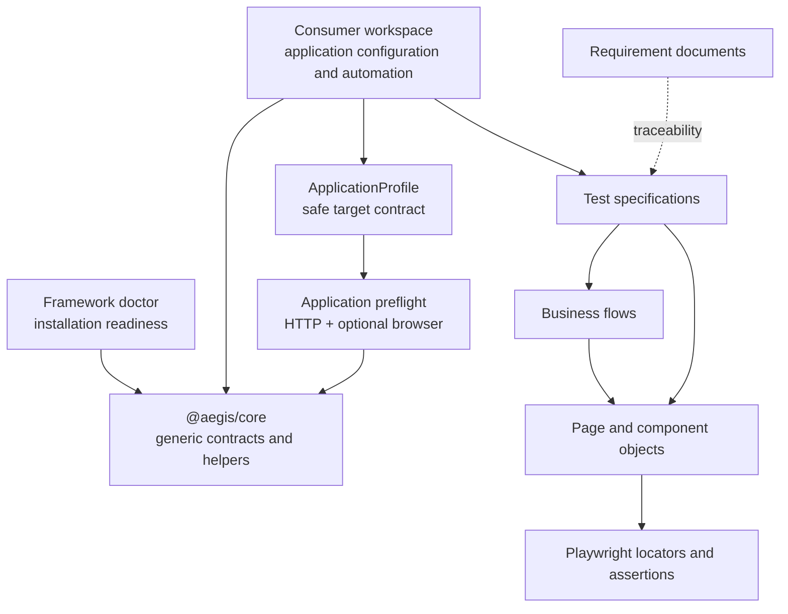

# Architecture

## Monorepo dependency model

Consumer workspaces may import named exports from `@aegis/core`. Core never imports from consumers, so application details cannot leak into the reusable package.

## Workspace responsibilities

- **`packages/core`** owns application-independent contracts and helpers that have a real consumer. It accepts consumer-provided defaults and does not read global environment state.
- **Consumer configuration** owns dotenv loading, application URLs, environment defaults, and Playwright configuration.
- **Requirements and tests** express application business intent and traceability.
- **Flows** coordinate complete application activities.
- **Pages and components** own application locators and explicit page-level verification.
- **Infrastructure** belongs to the application that requires it.

The USD parser remains consumer-specific. A future core monetary utility would need explicit locale and currency configuration plus a real cross-application consumer.

## Onboarding and readiness boundaries

Framework setup and doctor commands validate AegisAI itself. They do not need a target application. A consumer-owned `ApplicationProfile` supplies a safe URL and generic expectations to the reusable preflight runner. Preflight proves reachability and optionally one browser navigation, but it does not know how the application is hosted.

Application infrastructure remains a third, separate concern. The nopCommerce example owns Docker and PostgreSQL checks; another company application may use neither. This prevents core from acquiring application installation logic, database types, container names, or business data.

## Why there is no BasePage

A generic `BasePage` tends to collect unrelated navigation, waiting, selector, and assertion helpers. That inheritance hides dependencies and encourages broad abstractions with weak business meaning. Consumer projects instead use small composition-based objects that expose only behaviour owned by their page or component.

## Future package distribution

Workspace packages are private and source-linked today. A later milestone may add builds, versioning, and publication to a private npm registry so client projects can live in separate repositories. The current architecture must not be described as externally published.

## Future AI boundary

Future AI-assisted analysis or failure classification will live outside deterministic browser execution. Consumer browser tests must remain reproducible and capable of running without an AI service or credentials.
