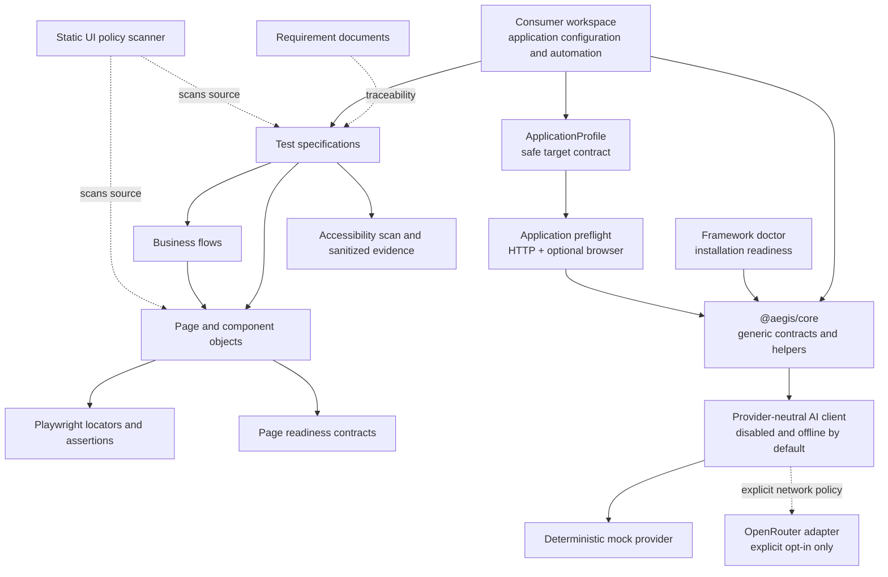

# Architecture

## Monorepo dependency model



Consumer workspaces may import named exports from `@aegis/core`. Core never imports from consumers, so application details cannot leak into the reusable package.

## Workspace responsibilities

- **`packages/core`** owns application-independent contracts and helpers that have a real consumer. It accepts consumer-provided defaults; only the narrow AI secret resolver may read one explicitly named environment variable at execution time and it never enumerates the environment.
- **Consumer configuration** owns dotenv loading, application URLs, environment defaults, and Playwright configuration.
- **Requirements and tests** express application business intent and traceability.
- **Flows** coordinate complete application activities.
- **Pages and components** own application locators and explicit page-level verification.
- **Infrastructure** belongs to the application that requires it.
- **UI quality tooling** owns generic readiness validation, accessibility processing, redaction, and deterministic source-policy analysis. Consumer pages provide their own landmarks, headings, and scan scope.
- **AI foundation** owns provider-neutral configuration, prompt/output validation, narrow secret resolution, usage limits, safe events, and provider adapters. It owns no application prompts or autonomous behavior.

The USD parser remains consumer-specific. A future core monetary utility would need explicit locale and currency configuration plus a real cross-application consumer.

## UI quality boundary

The static policy scanner evaluates source without launching a browser or contacting an application. It flags prohibited sleeps and XPath as high severity while treating scoped CSS and positional locators as reviewable evidence. Narrow next-line suppressions require a valid rule ID and reason.

At runtime, Page Objects call `waitForPageReady` with application-owned definitions. Meaningful headings, landmarks, titles, URLs, or test IDs establish readiness; network idle alone is not a business contract. Accessibility tests explicitly invoke `runAccessibilityScan` and attach only bounded sanitized evidence. The reusable default fails critical and serious findings, reports moderate and minor findings, and does not claim that automation proves WCAG compliance.

The framework workflow runs only the static UI policy gate. Live accessibility execution requires a provisioned consumer application and therefore remains outside generic CI.

## Onboarding and readiness boundaries

Framework setup and doctor commands validate AegisAI itself. They do not need a target application. A consumer-owned `ApplicationProfile` supplies a safe URL and generic expectations to the reusable preflight runner. Preflight proves reachability and optionally one browser navigation, but it does not know how the application is hosted.

Application infrastructure remains a third, separate concern. The nopCommerce example owns Docker and PostgreSQL checks; another company application may use neither. This prevents core from acquiring application installation logic, database types, container names, or business data.

## Continuous-integration boundaries

```mermaid
flowchart LR
    CORE[@aegis/core]
    CONSUMER[Consumer workspace]
    QUALITY[Framework quality<br/>doctor + static gates + unit tests]
    BROWSERS[Browser runtime matrix<br/>Chromium + Firefox + WebKit]
    REFERENCE[Reference consumer static checks<br/>traceability + test discovery]
    LIVE[Consumer-owned live E2E<br/>future provisioning milestone]

    QUALITY --> CORE
    BROWSERS --> CORE
    REFERENCE --> CONSUMER
    LIVE -. not provisioned by core CI .-> CONSUMER
```

Framework quality needs only the locked npm workspaces. Browser runtime checks use a deterministic `data:` URL and install one browser per matrix entry. Reference-consumer validation loads nopCommerce configuration, metadata, and tests only far enough to validate traceability and discovery; it does not launch a browser or contact the application. Docker, PostgreSQL, application installation, and live smoke execution remain consumer-owned concerns.

## Why there is no BasePage

A generic `BasePage` tends to collect unrelated navigation, waiting, selector, and assertion helpers. That inheritance hides dependencies and encourages broad abstractions with weak business meaning. Consumer projects instead use small composition-based objects that expose only behaviour owned by their page or component.

## Future package distribution

Workspace packages are private and source-linked today. A later milestone may add builds, versioning, and publication to a private npm registry so client projects can live in separate repositories. The current architecture must not be described as externally published.

## AI boundary

The current AI foundation is a disabled-by-default communication layer. It has a deterministic offline mock and an explicitly network-gated OpenRouter adapter, but no UI capability invokes it. Prompts are versioned, untrusted evidence is delimited and redacted, structured output is validated, and token/cost/retry/time limits apply before or around provider execution.

It does not analyse failures, screenshots, accessibility evidence, or DOM data; it does not generate tests, heal locators, execute tools, or modify source. Future AI-assisted capabilities must remain opt-in and outside deterministic browser execution. Consumer tests remain reproducible without an AI service or credentials. See [AI foundation](ai-foundation.md).
